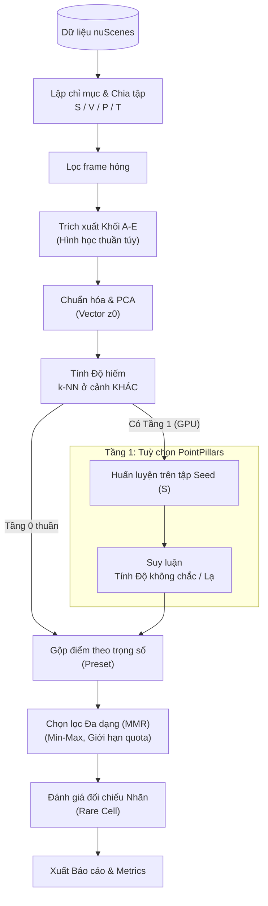

# Luồng Xử Lý Của Model (Model Workflow)

## 1. Bài toán và Ý tưởng
Hệ thống VCuboidFit giải quyết bài toán cốt lõi trong lĩnh vực xe tự hành: Làm sao để chọn lọc ra đúng 5% các khung hình (keyframe) LiDAR đáng giá nhất từ các khối dữ liệu thô khổng lồ để gửi đi gán nhãn 3D nhân công? Chi phí gán nhãn 3D (Bounding Box 3D) rất đắt đỏ, và nếu chỉ chọn ngẫu nhiên, mô hình học máy sẽ phải xem đi xem lại những khung cảnh xe chạy thẳng trên đường cao tốc không có chướng ngại vật, trong khi lại bỏ lỡ những tình huống hiểm nghèo (xe cắt ngang, chướng ngại vật lạ).

Ý tưởng cốt lõi của hệ thống là đề xuất một luồng xử lý hoàn toàn không giám sát ở Tầng 0 (sử dụng đặc trưng hình học) kết hợp với tín hiệu mô hình ở Tầng 1 (sử dụng mạng nơ-ron). Bằng cách kết hợp 2 hướng đi này, hệ thống sẽ tự động tìm ra các khung hình "hiếm" trong phân bố cấu trúc không gian và "lạ/khó" đối với góc nhìn của mô hình. Mục tiêu: cùng ngân sách 5% nhưng bắt được nhiều tình huống hiếm hơn so với chọn ngẫu nhiên.

## 2. Sơ đồ Tổng Quan

Sơ đồ dưới đây minh họa toàn bộ các bước mà một điểm dữ liệu LiDAR phải đi qua trong hệ thống.

## 3. Các Bước Xử Lý Chi Tiết

Phần này mô tả chi tiết từng bước, bao gồm lý do thực hiện, các tệp đầu vào/đầu ra và các tham số cấu hình chính (quy định trong tệp `configs/lidar.yaml`).

### Bước 1: Lập chỉ mục và Chia tập
- **Làm gì:** Duyệt toàn bộ tập dữ liệu gốc, định vị các keyframe có cảm biến LiDAR. Sau đó, chia các cảnh (scene) thành 4 tập độc lập: S (Seed), V (Validation), P (Pool), T (Test).
- **Vì sao:** Việc này giúp hệ thống tạo một bản đồ tra cứu nhanh để tránh đọc lại ổ cứng nhiều lần. Quá trình chia tập theo từng cảnh nguyên vẹn (thay vì chia theo frame lẻ tẻ) giúp cô lập dữ liệu, chống lại hiện tượng rò rỉ dữ liệu khi huấn luyện và đánh giá.
- **Input → Output:** Dữ liệu thư mục thô → `index.parquet`.
- **Tham số chính:** khối `splits` trong `configs/lidar.yaml` (số scene cho S và V; T là tập val chính thức của nuScenes).

### Bước 2: Lọc các khung hình hỏng
- **Làm gì:** Loại bỏ các khung hình bị lỗi (ví dụ không thể đọc tệp nhị phân) hoặc có quá ít điểm Point Cloud sau khi đã loại trừ các vùng nhiễu quá sát thân xe.
- **Vì sao:** Cam kết duy trì hệ thống không bị lỗi tiến trình hoặc đưa ra các kết quả sai lệch khi phải tính toán trên lượng dữ liệu rác.
- **Input → Output:** `index.parquet` → `filter.parquet`.
- **Tham số chính:** `pcd.remove_close_m` (bỏ điểm trên thân xe, mặc định 1 m), `filter.min_points` (frame dưới 2000 điểm bị loại).

### Bước 3: Trích xuất Đặc trưng (Descriptor A–E)
- **Làm gì:** Chuyển đổi đám mây điểm (point cloud) thành các biểu diễn thống kê dạng số liệu thông qua 5 khối riêng biệt:
  - **Khối A:** Phân bố khoảng cách (phân tích khoảng cách từ điểm tới cảm biến trung tâm).
  - **Khối B:** Độ cao (phân bố trục Z của các điểm, cùng mặt đường ước lượng bằng RANSAC).
  - **Khối C:** Bản đồ BEV (mật độ điểm trên không gian 2D khi nhìn từ trên xuống).
  - **Khối D:** Cụm vật thể (ứng dụng thuật toán gom cụm để bắt các vật thể tách rời khỏi mặt đất, chẳng hạn như xe cộ, người đi bộ).
  - **Khối E:** Cảm biến (phân tích chất lượng tín hiệu thu hồi và phản xạ của tia LiDAR).
- **Vì sao:** Các khối này giúp biểu diễn toàn cảnh không gian LiDAR dưới dạng một vector số học gọn nhẹ, cho phép các bước sau chạy trực tiếp trên CPU mà không cần đến mạng nơ-ron học sâu.
- **Tham số chính:** `pcd.crop_m` (cắt vùng ±50 m), `pcd.voxel_m` (lưới voxel trước khi gom cụm), khối `blocks` (mốc chia khoảng cách, độ cao, lưới BEV, gom cụm DBSCAN).

### Bước 4: Chuẩn hóa và PCA
- **Làm gì:** Chuẩn hóa từng khối A–E, gộp tất cả lại thành một vector lớn và dùng thuật toán Phân tích thành phần chính (PCA) để nén vector đó.
- **Vì sao:** Làm nổi bật các thành phần thông tin mang ý nghĩa cao nhất và loại bỏ các thành phần nhiễu hoặc có độ tương quan trùng lặp, từ đó tối ưu không gian và tăng tốc độ cho thuật toán khoảng cách ở bước kế tiếp.
- **Input → Output:** đám mây điểm → `desc_raw.npz` (descriptor thô A–E); chuẩn hoá và PCA tính lại trong bộ nhớ thành vector `z0`.
- **Tham số chính:** `pca_dim` (kích thước không gian vector nhúng sau khi giảm chiều).

### Bước 5: Tính Độ Hiếm (Rarity)
- **Làm gì:** Với mỗi khung hình, hệ thống sẽ tính toán khoảng cách trung bình của vector `z0` tới k khung hình gần nhất. Tuy nhiên, các khung hình láng giềng này bị ép buộc phải nằm ở các cảnh (scene) **KHÁC**.
- **Vì sao:** Mục đích là tìm ra các khung hình có cấu trúc không gian dị biệt nhất so với phần lớn dữ liệu. Việc buộc tìm láng giềng ở "cảnh khác" giúp vô hiệu hóa hiện tượng các khung hình kề nhau về mặt thời gian (chỉ cách nhau 0.5s) luôn luôn giống hệt nhau.
- **Tham số chính:** `defaults.k` (mặc định 10 láng giềng).

### Bước 6: Tầng 1 Tuỳ chọn (Tín hiệu từ Mô hình)
- **Làm gì:** Huấn luyện một mạng học sâu (PointPillars) từ đầu trên tập Seed (S). Sau đó, mô hình này sẽ tiến hành suy luận (inference) trên các tập còn lại để thu thập:
  - **Độ không chắc (Uncertainty):** Đo lường mức độ phân vân của mô hình thông qua Entropy của các hộp bounding box dự đoán.
  - **Độ bất nhất (Inconsistency):** Đo lường sự sai lệch dự đoán khi hệ thống lật ngược (flip) dữ liệu Point Cloud gốc.
  - **Độ lạ (Novelty):** Khoảng cách của đặc trưng nơ-ron so với những gì mô hình đã thấy trong tập S.
- **Vì sao:** Cung cấp thêm một lăng kính từ góc độ của Trí tuệ Nhân tạo, giúp phát hiện ra những khung hình tuy nhìn bình thường về mặt hình học nhưng lại cực kỳ hóc búa để mô hình có thể nhận diện đúng.
- **Input → Output:** khung hình của tập cần chọn → `signals.parquet` (mỗi frame một dòng tín hiệu).
- **Lưu ý:** tắt kỹ thuật dán vật thể từ cảnh khác (`gt_sampling`) khi huấn luyện, vì nó mang nhãn ngoài tập S vào mô hình.

### Bước 7: Gộp Điểm (Merge)
- **Làm gì:** cộng điểm Hiếm, Lạ với model, Model chưa chắc theo ba trọng số (`defaults.alpha/beta/gamma`); chỉ Tầng 0 thì chỉ còn điểm Hiếm.
- **Vì sao:** Cung cấp tính linh hoạt cho người dùng cấu hình chiến lược chọn lọc trên giao diện (các preset "Cân bằng", "Hiếm trước", "Khó với model", "Kịch bản an toàn" trong khối `presets`).

### Bước 8: Chọn Lọc Đa Dạng (MMR)
- **Làm gì:** Chọn tuần tự các khung hình cho đến khi lấp đầy ngân sách (ví dụ 5% tổng dữ liệu). Thuật toán Maximal Marginal Relevance (MMR) sẽ ưu tiên khung hình có điểm số cao, nhưng đồng thời sẽ phạt/trừ điểm khung hình đó nếu nó có độ tương đồng (cosine similarity) quá cao so với những khung đã được chọn trước đó.
- **Vì sao:** Để ngăn chặn tình trạng thuật toán "bỏ trứng vào một rổ" – tức là chọn ra 100 khung hình có điểm hiếm rất cao nhưng lại là chuỗi liên tiếp của cùng một khoảnh khắc chiếc xe đi qua một ngã tư duy nhất.
- **Luật áp dụng:** Điểm số đầu vào được chuẩn hóa Min-Max, cắt bỏ các giá trị nhiễu ở phân vị 1/99; đồng thời giới hạn số khung tối đa được lấy từ mỗi cảnh (quota) để ép buộc hệ thống phải lấy dữ liệu trải rộng.
- **Tham số chính:** `mmr_score: minmax`, `defaults.lam` (0.7: cân bằng điểm và độ đa dạng; 1.0 là tắt đa dạng), `defaults.m` (tối đa 4 frame mỗi scene), `defaults.budget` (0.05).

### Bước 9: Đánh Giá và Xuất Báo Cáo
- **Làm gì:** Module đánh giá sẽ đọc nhãn 3D thực tế để đối chiếu khả năng bắt trúng khung hình chứa vật thể hiếm của hệ thống so với kết quả nếu chọn ngẫu nhiên (sử dụng 10 seed ngẫu nhiên).
- **Định nghĩa Rare Cell:** mỗi vật thể thuộc một cell theo bộ ba: lớp vật thể × khoảng cách × số điểm LiDAR trên vật. Một khung hình là "hiếm thật" nếu chứa vật thể thuộc cell xuất hiện ở dưới 2% số frame (ngưỡng τ = 0.02 trong `configs/gt.yaml`). Ngưỡng được chốt một lần trước khi chấm, dựa trên bảng thống kê `lidar_g1`: nếu quá 20% frame bị tính là hiếm thì dùng 0.01.
- **Input → Output:** danh sách frame đã chọn → `metrics.json` và `report_selection.md` (bảng so sánh các phương pháp). Bảng `g1_table` do lệnh `lidar_g1` sinh riêng.

## 4. Chống Rò Rỉ Nhãn (Anti-Leakage)
Để duy trì tính minh bạch và trung thực trong báo cáo khoa học:
- Nhãn 3D (Ground Truth) tuyệt đối không được tiết lộ cho bất kỳ quy trình nào từ Bước 1 đến Bước 8.
- Chỉ duy nhất ở Bước 9 (Module đánh giá), hệ thống mới được cấp quyền đọc nhãn thực tế để đối chiếu kết quả.
- Tập P (Pool) là tập dữ liệu thử nghiệm tối thượng, chỉ được đem ra chạy đánh giá **một lần duy nhất** sau khi mọi tham số, trọng số đã được đóng băng. Không một ai được phép nhìn vào kết quả trên tập P để quay lại sửa đổi thuật toán.

## 5. Bảng Lệnh CLI

Hệ thống cung cấp 4 lệnh dòng lệnh độc lập (thực thi qua `worker/.venv/Scripts/python -m c4.cli.<x>`). Để tra cứu toàn bộ các tham số, vui lòng gọi kèm cờ `--help` trên terminal:

1. **`lidar_index`:**
   - Dùng để lập chỉ mục và chia các tập.
   - Lệnh: `python -m c4.cli.lidar_index --data-root <nuScenes> --job-dir <thư_mục_job> [--limit N]`
2. **`lidar_t0`:**
   - Chạy luồng phân tích Tầng 0 cơ bản cho môi trường tích hợp.
   - Lệnh: `python -m c4.cli.lidar_t0 --data-root <nuScenes> --job-dir <thư_mục_job> [--resume]`
3. **`lidar_g1`:**
   - Đọc nhãn để sinh bảng thống kê tần suất phân bổ vật thể (phục vụ việc phân tích ngưỡng).
   - Lệnh: `python -m c4.cli.lidar_g1 --data-root <nuScenes> --out <thư_mục> [--taus 0.005,0.01,0.02,0.05]`
4. **`lidar_experiment`:**
   - Lệnh chủ lực dùng cho các hoạt động nghiên cứu: Chạy MMR, đối chiếu ngẫu nhiên và tính toán metrics tổng thể.
   - Lệnh: `python -m c4.cli.lidar_experiment --data-root <thư_mục> --out <thư_mục> --split {V,P,S,T,pool} [--tune] [--bootstrap] [--n-jobs]`

(Lưu ý: Tầng 1 do yêu cầu phức tạp về môi trường GPU PyTorch, sẽ không chạy bằng CLI đơn lẻ mà được bọc qua các kịch bản shell chuyên biệt như `scripts/tier1.ps1` hoặc `scripts/tier1.sh`).

## 6. Đọc Kết Quả
Sau khi hoàn tất, hệ thống sẽ sinh ra các tệp báo cáo điểm số. Vui lòng đọc tệp [glossary.md](glossary.md) để hiểu rõ ràng và thống nhất các thuật ngữ chính, bao gồm:
- Tỉ lệ bắt được frame hiếm.
- Điểm tổng.
- Độ hiếm ước lượng.
- Lạ với model.
- Model chưa chắc chắn.

## 7. Chạy Hệ Thống Ở Đâu?
VCuboidFit được thiết kế để tương thích với đa dạng hạ tầng từ máy cá nhân đến đám mây. Bạn có thể xem thêm hướng dẫn cài đặt tương ứng với nền tảng của mình:
- [Chạy Local / Web (run-local.md)](run-local.md)
- [Thuê GPU Đám mây (gpu-rental.md)](gpu-rental.md)
- [Môi trường Kaggle / Colab (kaggle-colab.md)](kaggle-colab.md)

## 8. Vì sao có hai tầng
- **Tầng 0 (hình học):** chỉ cần CPU, chạy nhanh, không phụ thuộc vào việc một mô hình đã học gì. Đây là đường mặc định.
- **Tầng 1 (PointPillars):** cần GPU; thêm góc nhìn "frame nào khó với mô hình". Giá trị của tầng này phụ thuộc cỡ tập seed, nên chỉ nên chạy sau khi đã có kết quả Tầng 0 trên dữ liệu đủ lớn.

## 9. Tham số chính (`configs/lidar.yaml`)

| Tham số | Mặc định | Ý nghĩa |
|---|---|---|
| `pcd.remove_close_m` | 1.0 | Bỏ điểm trên thân xe |
| `pcd.crop_m` | 50.0 | Chỉ xét vùng ±50 m quanh xe |
| `pcd.voxel_m` | 0.2 | Lưới voxel trước khi gom cụm |
| `filter.min_points` | 2000 | Frame ít điểm hơn bị loại |
| `pca_dim` | 64 | Số chiều vector `z0` |
| `mmr_score` | `minmax` | Cách chuẩn hoá điểm trước MMR |
| `defaults.budget` | 0.05 | Ngân sách: 5% số frame |
| `defaults.k` | 10 | Số láng giềng khi tính độ hiếm |
| `defaults.lam` | 0.7 | Cân bằng điểm và độ đa dạng |
| `defaults.m` | 4 | Tối đa số frame mỗi scene |
| `defaults.alpha/beta/gamma` | 1 / 0 / 0 | Trọng số Hiếm / Lạ với model / Chưa chắc |
| `random_seeds` | 0–9 | 10 lần chọn ngẫu nhiên để so sánh |
