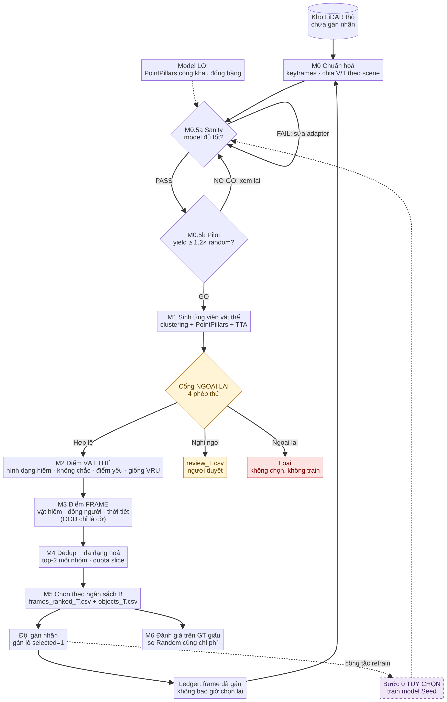
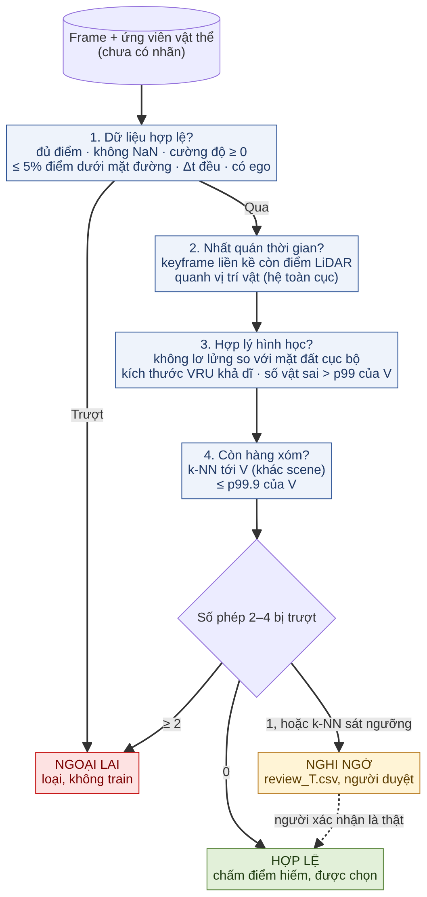
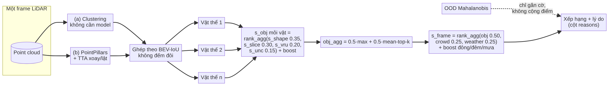
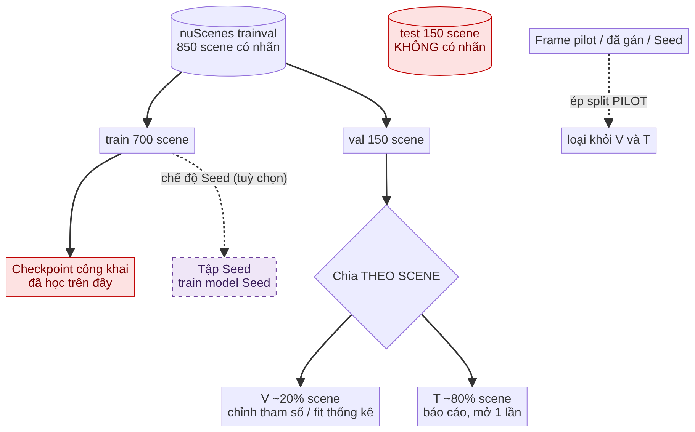
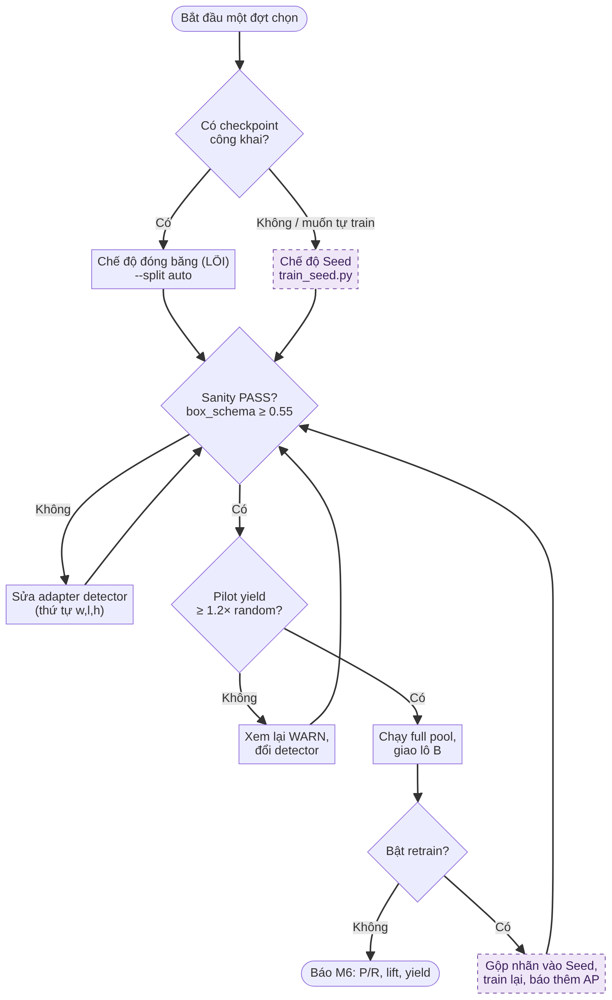
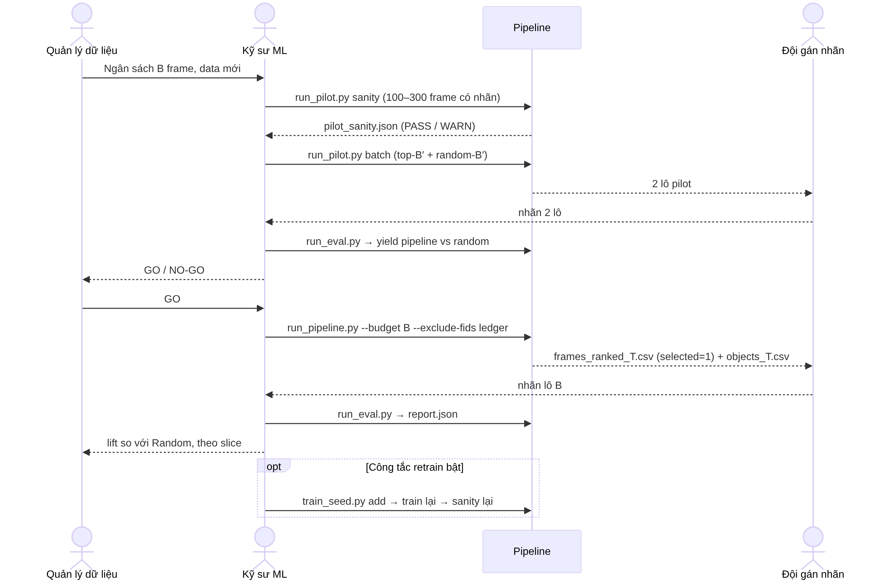

# Rare-Frame Mining: đọc trong 10 phút

> Bản tổng quan cho **cả team**: dev, kỹ sư ML, quản lý dữ liệu, người gán nhãn, mentor.
> Không cần đọc code vẫn hiểu hệ thống làm gì, chạy thế nào và đọc kết quả ra sao.
> Phiên bản v2.3 (10/10/2026). Chi tiết hơn: `HUONG_DAN_NGUOI_DUNG.md` (từng lệnh) và
> `PHAN_TICH_CAC_LUONG.md` (từng module, từng metric).

---

## 1. Một câu tóm tắt

Công ty có rất nhiều dữ liệu LiDAR nhưng không đủ tiền gán nhãn hết. Hệ thống này **xếp hạng
frame nào nên gán nhãn trước**, ưu tiên frame chứa tình huống **hiếm và nguy hiểm cho người đi
đường (VRU: người đi bộ, xe đạp, xe máy)**, để mỗi đồng gán nhãn thu được nhiều dữ liệu hiếm hơn
so với chọn ngẫu nhiên.

| | |
|---|---|
| **Đầu vào** | LiDAR thô chưa nhãn · một model 3D có sẵn (PointPillars) · ngân sách B frame do công ty chọn |
| **Đầu ra** | Danh sách frame xếp hạng **kèm lý do** · trong mỗi frame, các vật thể hiếm **đã khoanh sẵn box** |
| **Thước đo thành công** | So với **Random cùng số frame**: bắt được nhiều frame/vật hiếm hơn (recall, precision, yield) |
| **Không làm** | Không sinh ảnh, không dùng nhãn khi chọn, không suy "đêm" từ point cloud |

## 2. "Hiếm" nghĩa là gì (theo đề bản chốt 9/10)

| Loại | Điều kiện | Ghi chú |
|---|---|---|
| Lớp hiếm | xe đạp, xe máy | nuScenes mất cân bằng lớp rất mạnh (LT3D, CoRL'22) |
| Vật xa / ít điểm | VRU cách xe > 30 m hoặc < 10 điểm LiDAR | theo REM (ECCV'22) đây là **khó** (hard), không phải **hiếm**: giữ vì đề yêu cầu, báo cáo tách riêng |
| Cảnh đông | ≥ 5 người đi bộ | |
| Thời tiết xấu | mưa, đêm | đêm chỉ lấy từ metadata/camera; LiDAR là cảm biến chủ động, không "tối" đi ban đêm |

**Frame hiếm** = có ít nhất một vật hiếm, hoặc đông người, hoặc đêm, hoặc mưa.

Bốn khái niệm team hay nhầm, cần phân biệt khi viết báo cáo:

| Thuật ngữ | Nghĩa | Ví dụ |
|---|---|---|
| **Rare** (hiếm) | xuất hiện ít trong dữ liệu | xe máy, cảnh mưa |
| **Hard** (khó) | model dễ sai, dù không hiếm | người bị che, người ở 45 m |
| **Uncertain** (không chắc) | model dự đoán dao động | box nhảy khi lật point cloud |
| **Novel** (lạ) | khác dữ liệu model đã học | loại xe chưa từng thấy |

## 3. Quy trình tổng thể



Đọc sơ đồ từ trên xuống:

1. **M0 Chuẩn hoá**: chỉ dùng keyframe, chia tập V/T **theo scene** (không theo frame, vì hai
   frame liền nhau gần như giống hệt nhau, chia theo frame là lộ đáp án).
2. **Hai cổng kiểm tra trước khi chạy lớn** (điểm dừng rẻ nhất của dự án):
   - **M0.5a Sanity**: chạy model trên 100–300 frame có nhãn, kiểm tra box có đúng định dạng,
     model có bắt được VRU ở xa, lớp hiếm không.
   - **M0.5b Pilot**: gán thử hai lô nhỏ (pipeline chọn và random chọn), nếu pipeline thu được
     ≥ 1,2 lần số VRU so với random thì **GO**.
3. **Cổng NGOẠI LAI** ngay sau M1: tách frame lỗi/không giải thích được ra trước khi chấm
   điểm hiếm (mục 4).
4. **M1–M3 Chấm điểm 2 cấp**: vật thể trước, frame sau (mục 5).
5. **M4–M5**: bỏ frame trùng, đảm bảo đủ loại tình huống, chọn đúng B frame.
6. **Gán nhãn → Ledger**: frame đã gán không bao giờ được chọn lại ở vòng sau.
7. **M6 Đánh giá**: dùng nhãn thật **đã giấu** để chấm xem bảng xếp hạng có tốt hơn Random không.
8. **Khối tím nét đứt = tuỳ chọn**: Bước 0 train model Seed và vòng retrain (mục 7).

## 4. Hiếm khác Ngoại lai: cổng lọc trước khi chọn

**Hai loại này rất dễ nhầm, vì cả hai đều "lạ".** Một điểm OOD duy nhất không tách được chúng:
frame mưa to và frame lỗi cảm biến đều cách xa dữ liệu bình thường. Nguyên tắc của dự án
(Phương án chốt 10/10):

| | **Frame hiếm** | **Frame ngoại lai** |
|---|---|---|
| Bản chất | ít gặp nhưng **có thật và nhất quán** | **lỗi dữ liệu** hoặc không giải thích được |
| Ví dụ | xe máy chở người ban đêm, nhóm 8 người qua đường, mưa | mất 90% điểm, NaN, calib sai làm điểm rơi dưới đường, cụm điểm "ma" chỉ có trong 1 frame |
| Xuất hiện lại ở frame kế tiếp? | có | thường không |
| Có "hàng xóm" trong dữ liệu đã thấy? | xa nhưng vẫn có vài hàng xóm | cô lập hoàn toàn |
| Xử lý | chấm điểm, được chọn để gán nhãn | **không chọn, không train**; đưa ra danh sách duyệt |



Cổng chạy **ngay sau M1, trước khi chọn**, gồm 4 phép thử, không dùng nhãn:

1. **Dữ liệu hợp lệ** (luật): đủ điểm (≥ 25% số điểm trung vị của pool), không NaN/inf, cường
   độ không âm, ≤ 5% điểm thấp hơn mặt đường 1 m, Δt giữa hai keyframe đều, có ego pose.
2. **Nhất quán theo thời gian**: đưa vị trí vật giống VRU sang hệ toàn cục bằng tư thế xe, rồi
   xem keyframe liền trước hoặc liền sau **còn điểm LiDAR** quanh đó không (bán kính 1,5 m +
   3 m/s × Δt, đủ cho người đi bộ và xe đạp chậm). Frame trượt khi ≥ 2 vật không có mặt lại và
   con số này vượt phân vị 99 của V. Điểm "ma" chỉ có 1 lần.
3. **Hợp lý hình học**: vật giống VRU không lơ lửng (đáy cao hơn mặt đất *cục bộ* quanh vật
   > 1 m); box model gán lớp người/xe đạp/xe máy phải có kích thước khả dĩ. Frame chỉ trượt khi
   số vật sai **vượt phân vị 99 của tập V**, vì ngoài đời luôn có tán cây, biển báo bị nhận nhầm.
4. **Còn hàng xóm**: khoảng cách k-NN (k = 5) tới frame của tập V ở scene khác không vượt
   phân vị 99,9 của chính V. Nếu cả loạt frame T cùng cô lập → báo **lệch domain**, không phải hiếm.

Kết quả chia 3 nhóm:

- **Hợp lệ**: qua đủ, được chấm điểm hiếm và chọn.
- **Nghi ngờ**: trượt đúng 1 phép trong 2–4, hoặc k-NN sát ngưỡng → `review_T.csv` cho người
  duyệt, **không giao gán nhãn**. Người xác nhận là thật thì vòng sau chuyển sang nhóm hiếm.
- **Ngoại lai**: trượt phép 1, hoặc trượt từ 2 phép trở lên → loại.

**OOD giờ chỉ là cờ cảnh báo** (`ood_flag`, `w_ood = 0`), không còn cộng vào điểm chọn như bản
Genspark gốc; nếu cộng, frame lỗi sẽ được đẩy lên đầu danh sách như frame hiếm.

**Cách chứng minh cổng tách đúng** (có sẵn trong `report.json → outlier_gate`):
- *Lỗi giả trên V*: cố ý làm hỏng frame V hợp lệ theo 4 kiểu (thưa điểm, NaN, điểm dưới mặt
  đường, chèn cụm "ma"), đo tỉ lệ **lọt vào nhóm Hợp lệ** (`leak_rate`, càng thấp càng tốt).
- *Frame hiếm thật bị loại nhầm*: trong các frame T hiếm theo nhãn, bao nhiêu % bị xếp Ngoại
  lai / Nghi ngờ (`rare_true_as_outlier`, `rare_true_as_suspect`, càng thấp càng tốt).

**Đo trên 404 keyframe nuScenes mini** (10 scene, V = 82 frame, T = 322 frame, detector giả lập,
`--split all --model-provenance external`, chỉ để hiệu chỉnh cổng):

| Chỉ số | Kết quả |
|---|---|
| Frame T: Hợp lệ / Nghi ngờ / Ngoại lai | 265 / 57 / 0 (nuScenes là dữ liệu sạch nên không có Ngoại lai là hợp lý) |
| Lý do Nghi ngờ chính | phép 3 hình học (~45 frame), còn lại phép 2 và k-NN |
| Lỗi giả "thưa điểm" lọt vào Hợp lệ | 0/20 (cả 20 thành Ngoại lai) |
| Lỗi giả "NaN" lọt vào Hợp lệ | 0/20 |
| Lỗi giả "điểm dưới mặt đường" lọt vào Hợp lệ | 0/20 |
| Lỗi giả "cụm ma" (4 cụm giống người chỉ có trong 1 frame) lọt vào Hợp lệ | **13/20 (65%)**, 7 thành Nghi ngờ |
| Frame hiếm thật (theo nhãn) bị xếp Ngoại lai | 0% |
| Frame hiếm thật bị xếp Nghi ngờ | 18,1% (bằng tỉ lệ Nghi ngờ chung 17,7%, tức cổng không nhắm riêng vào frame hiếm) |

Đọc kết quả: cổng chặn chắc lỗi cảm biến/ghi file, không loại nhầm frame hiếm thật, nhưng **còn
yếu với cụm "ma"**. Số đo trên mini chỉ để chỉnh ngưỡng; báo số chính thức trên 150 scene val
với PointPillars thật.

Giới hạn đã biết: phép 2 là phép yếu nhất. Cụm "ma" rơi cạnh tường, xe đỗ hay bụi cây thì
keyframe kế bên vẫn có điểm thật ở đó nên lọt; xe đạp nhanh hơn 3 m/s có thể bị báo nhầm. Vì vậy
trượt riêng phép này chỉ đưa vào nhóm Nghi ngờ, không loại hẳn. Nguồn dữ liệu không có tư thế xe
(BinDir thiếu pose) thì phép 2 quay về cách cũ, đối chiếu theo ứng viên, kém chặt hơn. Phép 3 phụ
thuộc chất lượng detector: với detector giả lập, khoảng một nửa box "VRU" là tán cây/biển báo
lơ lửng, nên ngưỡng tuyệt đối ban đầu đã loại nhầm gần hết frame thật (đã sửa bằng ngưỡng theo V).
Khi cắm PointPillars thật cần đo lại.

## 5. Chấm điểm 2 cấp hoạt động thế nào



- **Tìm vật thể bằng 2 nguồn song song.** (a) Clustering điểm, không cần model: bắt được cả
  những vật **model bỏ sót** (thường chính là vật hiếm). (b) PointPillars + TTA (chạy thêm bản
  xoay/lật để xem model có chắc không). Hai nguồn ghép theo BEV-IoU để không đếm một vật hai lần.
- **Điểm vật thể** gộp 4 tín hiệu bằng **xếp hạng** (không cộng số thô, vì mỗi tín hiệu một
  thang đo): hình dạng hiếm (IsolationForest), rơi vào điểm yếu (xa, ít điểm, cặp lớp hay nhầm),
  giống VRU, và độ không chắc của model (trọng số thấp nhất: hiếm ≠ không chắc).
- **Điểm frame** = vật hiếm nhất trong frame + đông người + thời tiết. Khác phân phối (OOD)
  **chỉ gắn cờ**, không cộng điểm (mục 4).
- Mỗi frame có cột **`reasons`** bằng chữ, ví dụ: *"có vật lớp hiếm (bicycle/motorcycle); mưa
  (1.00); có vật xa >30 m hoặc <10 điểm; cờ OOD (5.51) — chỉ cảnh báo"*. Người gán nhãn đọc được, không cần hiểu
  công thức.

## 6. Chia dữ liệu và chống "lộ đáp án"



- Checkpoint PointPillars công khai **đã học trên 700 scene train** của nuScenes. Nếu để các
  scene này vào V/T, model "quen mặt" chúng và mọi tín hiệu không chắc/lạ đều sai.
  → Code **chỉ cho chạy trên 150 scene val** (`--split auto`), chặn cứng nếu chọn sai.
- Trong 150 scene val: **V** (~20% scene) để chỉnh tham số và fit thống kê; **T** (~80%) chỉ
  để báo cáo, mở một lần.
- Frame pilot, frame đã gán, frame Seed bị ép vào nhóm **PILOT** và loại khỏi V/T.
- **Nhãn thật chỉ M6 (đánh giá) và M0.5 (kiểm tra) được nhìn.** Mọi bước chọn đều không dùng nhãn.

## 7. Hai chế độ dùng model (quyết định 10/10: "Cả hai")



| | **Đóng băng (LÕI, mặc định)** | **Seed + retrain (TUỲ CHỌN)** |
|---|---|---|
| Model | checkpoint PointPillars công khai | model tự train trên frame đã có nhãn |
| Train | không | `scripts/train_seed.py` chuẩn bị dữ liệu, train trên máy GPU |
| Vòng lặp | chỉ loại frame đã gán | frame vừa gán được thêm vào Seed rồi train lại |
| Phương án B | không | `--explore-frac`: gán thêm một ít frame **ngẫu nhiên** để giữ phân phối chung |
| Báo cáo | M6 (P/R, lift, yield) | M6 **+ AP của model sau mỗi vòng** |
| Bật bằng | mặc định | `--model-mode seed --seed-manifest ... --retrain` |

## 8. Ai dùng hệ thống, dùng thế nào (user story)



| # | Là… | Tôi muốn… | Để… | Tiêu chí chấp nhận |
|---|---|---|---|---|
| US1 | **Quản lý dữ liệu** | đưa ngân sách B và nhận danh sách B frame nên gán | không phí tiền gán frame bình thường | `frames_ranked_T.csv` có đúng B dòng `selected=1`; báo cáo cho thấy lift so với Random |
| US2 | **Người gán nhãn** | biết vì sao frame được chọn và vật nào cần chú ý | gán nhanh, không bỏ sót vật hiếm | mỗi frame có `reasons`; `objects_T.csv` có box khoanh sẵn; cột `missed_by_model=1` đánh dấu vật model bỏ sót |
| US3 | **Kỹ sư ML** | kiểm tra model trên tập nhỏ trước khi chạy cả kho | không đốt hàng giờ GPU rồi mới phát hiện lỗi | `run_pilot.py sanity` trả PASS/WARN cho 4 check; pilot ra GO/NO-GO theo yield |
| US4 | **Kỹ sư ML** | cắm dữ liệu công ty (không phải nuScenes) | dùng hệ thống trên data thật | thư mục `.npy/.bin` + `meta.json` (+ `gt.json` nếu muốn đánh giá) chạy được toàn luồng |
| US5 | **Dev** | sửa một module mà không phá phần khác | an toàn khi mở rộng | `python3 tests/test_smoke.py` 10/10 OK; demo tạo đủ file đầu ra |
| US6 | **Mentor / người chấm** | thấy bằng chứng hệ thống thật sự tốt hơn ngẫu nhiên | tin kết quả | `report.json` có Random ×10 seed (mean±std), ablation rule-only và confidence-only, CI bootstrap theo scene |
| US7 | **Quản lý dữ liệu** | (tuỳ chọn) dùng nhãn mới để model tốt lên | dữ liệu gán xong có giá trị gấp đôi | bật `--retrain`; báo cáo có khối `model` và AP sau vòng |
| US8 | **Kỹ sư ML** | không bao giờ chọn lại frame đã gán | không trả tiền hai lần | `--exclude-fids ledger.json`; `n_pilot_excluded > 0` trong report |

## 9. Chạy thử trong 3 lệnh (không cần GPU, không cần nuScenes)

```bash
unzip rare_frame_mining.zip && cd rare_frame_mining
python3 -m pip install -r requirements.txt
python3 tests/test_smoke.py && python3 scripts/demo_synthetic.py
```

Kết quả nằm ở `demo_output/`. **Số liệu demo không phải hiệu năng**: dữ liệu giả có ~79% frame
hiếm (cố ý), nên Random cũng rất mạnh. Demo chỉ chứng minh code chạy đúng.

Chạy trên nuScenes (cần `pip install nuscenes-devkit`):

```bash
python3 scripts/run_pipeline.py --source nuscenes --dataroot /data/nuScenes \
    --version v1.0-trainval --budget 200 --out outputs_run1     # split auto = 150 scene val
python3 scripts/run_eval.py --out outputs_run1
```

## 10. Đọc kết quả

| File | Ai đọc | Xem gì |
|---|---|---|
| `frames_ranked_T.csv` | đội gán nhãn, quản lý | `rank`, `selected=1` (lô giao gán), `explore=1` (lô ngẫu nhiên, chỉ khi retrain), `gate`, `ood_flag`, `reasons` |
| `review_T.csv` | người duyệt dữ liệu | frame **Nghi ngờ / Ngoại lai** và lý do trượt cổng (`gate_fail`); không giao gán nhãn |
| `objects_T.csv` | đội gán nhãn | box khoanh sẵn (`cx, cy, cz, L, W, H, yaw`), `missed_by_model`, `reasons` |
| `report.json` | kỹ sư ML, mentor | xem mục dưới |
| `config_used.json` | dev | toàn bộ tham số của lần chạy, giữ lại để tái lập |

Thứ tự đọc `report.json`:

1. **`base_rate`**: tỉ lệ frame hiếm trong T. Base rate càng cao, Random càng mạnh.
2. **`lift_over_random`**: recall của pipeline trừ recall của Random. Phải dương và lớn hơn
   `random_std` mới đáng tin. **Đây là con số quan trọng nhất.**
3. **`rule_only_ablation`**: nếu pipeline ngang bản chỉ dùng luật, các tín hiệu học (hình dạng,
   không chắc) không đóng góp gì.
4. **`slices`**: hệ thống mạnh/yếu ở loại hiếm nào; slice ít mẫu thì xem khoảng `wilson`.
5. **`yield_vru_per_frame`**: số VRU thu được trên mỗi frame gán, nói bằng ngôn ngữ chi phí.
6. **`outlier_gate`**: số frame mỗi nhóm, tỉ lệ lỗi giả lọt cổng, tỉ lệ frame hiếm thật bị loại nhầm.
7. **`model`**: đang dùng checkpoint công khai hay model Seed, có retrain không.

## 11. Bản đồ thư mục

```
rare_frame_mining/
├── rare_mining/            # thư viện
│   ├── config.py           # MỌI tham số (ngưỡng, trọng số, quota, chế độ model)
│   ├── data.py             # nguồn dữ liệu: BinDir (công ty), nuScenes, chống leak split
│   ├── features.py         # loại mặt đất, clustering, đặc trưng cụm điểm
│   ├── detectors.py        # PointPillars (mmdet3d / openpcdet / heuristic) + TTA
│   ├── m1_candidates.py    # M1 ứng viên vật thể
│   ├── m2_object_score.py  # M2 điểm vật thể
│   ├── m3_frame_score.py   # M3 điểm frame
│   ├── m4_aggregate.py     # M4 dedup + quota
│   ├── m5_select.py        # M5 ghi CSV/JSON
│   ├── m05_pilot.py        # M0.5 sanity + pilot
│   ├── outlier_gate.py     # cổng NGOẠI LAI (4 phép thử) + lỗi giả để kiểm chứng
│   ├── m6_evaluate.py      # M6 đánh giá
│   ├── weather.py          # đêm/mưa
│   └── pipeline.py         # nối M0 → M5
├── scripts/                # run_pipeline, run_pilot, run_eval, demo_synthetic, train_seed
├── tests/test_smoke.py     # 10 test nhanh
└── docs/                   # tài liệu này + hướng dẫn + phân tích + sơ đồ
```

## 12. Trạng thái hiện tại (trung thực)

| Hạng mục | Trạng thái |
|---|---|
| Toàn luồng M0–M6 trên dữ liệu giả | ✅ chạy, 10/10 test |
| Cổng ngoại lai | ✅ có, đo trên nuScenes mini (mục 4); ngưỡng mới là mặc định, cần chỉnh lại trên trainval |
| Chạy trên nuScenes v1.0-mini thật (LiDAR keyframe) | ✅ chạy hết luồng, nhưng mini_val chỉ 2 scene nên **chưa có số để báo cáo** |
| Detector thật | ⚠️ mới chạy bằng detector **giả lập (heuristic)**; adapter mmdet3d chưa thử, adapter OpenPCDet cần map output theo phiên bản |
| Bước 0 Seed / retrain | ⚠️ đã có script chuẩn bị dữ liệu và in lệnh train; **chưa train thật** (cần GPU) |
| Số liệu báo cáo thật | ❌ cần nuScenes trainval (150 scene val) + PointPillars thật |

Một con số cần biết: trên 404 keyframe nuScenes mini, nếu luật "xa/ít điểm" tính mọi lớp thì
**404/404 frame đều "hiếm"**; chỉ tính VRU còn 354/404; chỉ xe đạp/xe máy là 265/404. Vì vậy
mặc định luật chỉ tính VRU (`far_few_scope="vru"`), và mọi kết quả phải đọc kèm `base_rate`.

## 13. Hỏi nhanh

- **Có train lại model không?** Lõi thì không. Bật công tắc retrain thì có (mục 7).
- **Frame lạ có phải là frame hiếm không?** Chưa chắc. Lạ vì lỗi → Ngoại lai; lạ nhưng thật và
  nhất quán → hiếm. Cổng ngoại lai (mục 4) quyết định trước khi chấm điểm.
- **Có cần camera không?** Không. Camera chỉ là tuỳ chọn để xác định đêm khi không có metadata.
- **Sao không chạy cả 390k sweep?** Tốn ×10 I/O mà frame liền nhau gần như trùng; chỉ dùng ~40k keyframe.
- **Sao không cộng điểm trực tiếp?** Mỗi tín hiệu một thang đo; xếp hạng rồi gộp thì không cần chuẩn hoá và bền nhiễu hơn.
- **Đổi ngưỡng ở đâu?** `rare_mining/config.py` hoặc file JSON truyền qua `--config`.
- **Muốn vẽ lại sơ đồ?** Nguồn Mermaid ở `docs/diagrams/*.mmd` (GitHub hiển thị trực tiếp);
  ảnh PNG trong `docs/img/`; sơ đồ module chi tiết: `python3 docs/make_diagram.py`.
